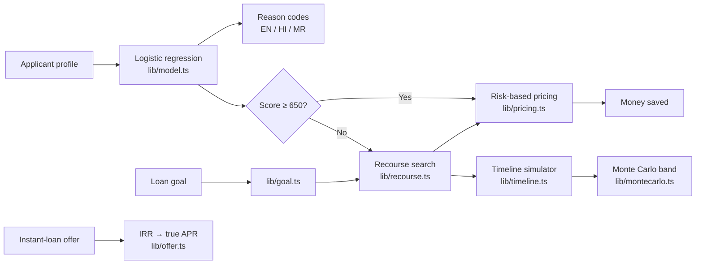

<div align="center">


<h3>Explainable credit decisions, a realistic path to approval, and the money it saves you.</h3>

<a href="https://pathway-credit-recourse.vercel.app"></a>


<br/>


</div>

---

## Why Pathway?

When a loan is declined, most people get a one-line "no" and a list of codes. They don't know **why**, **what to change**, or **when** to try again. Many then turn to instant-loan apps with hidden fees and triple-digit APRs.

**Pathway turns a rejection into a roadmap.** It explains the decision in plain English, Hindi or Marathi. It finds the smallest realistic set of changes that flips the decision, projects month by month when you'll get there, and shows what that's worth in interest saved.

> **Disclaimer:** Pathway is an educational simulation built on a public dataset. It is not a credit decision, not financial advice, and not affiliated with any lender. No lender uses it.

> **Live demo:** the linked deployment was last checked on 2026-10-03, before the current (version 2) model described below. It shows this model only after the next deploy.

## Features

<table>
<tr>
<td width="50%" valign="top">&nbsp;<b>Why: reason codes</b><br/>&nbsp;Exact per-feature score impact from an interpretable model, ranked and written in plain language.</td>
<td width="50%" valign="top">&nbsp;<b>What: lowest-effort plan</b><br/>&nbsp;An exhaustive search over realistic changes. Every action is scored by the model itself, and only inputs the model uses are ever asked for (not age or dependents).</td>
</tr>
<tr>
<td valign="top">&nbsp;<b>Money saved</b><br/>&nbsp;The same loan borrowed today versus after the plan: APR tier, EMI, total interest and the next-tier bonus.</td>
<td valign="top">&nbsp;<b>When, and how sure</b><br/>&nbsp;A Monte Carlo timeline: 400 seeded futures with shocks and slips give a likely, best and worst approval month.</td>
</tr>
<tr>
<td valign="top">&nbsp;<b>Goal planner</b><br/>&nbsp;Start from the loan you want ("$X at ≤ A% APR") and work backwards to the score, plan, milestones and affordability.</td>
<td valign="top">&nbsp;<b>Offer check</b><br/>&nbsp;The true APR of any instant-loan offer from its real cash flows, with red flags and guidance relevant in India.</td>
</tr>
<tr>
<td valign="top">&nbsp;<b>Fairness audit + lender report</b><br/>&nbsp;Risk-adjusted recourse-effort gaps by age and income, plus a printable adverse-action style report.</td>
<td valign="top">&nbsp;<b>Built for Bharat</b><br/>&nbsp;English, Hindi and Marathi throughout, phone-first, accessible, with a light pastel UI.</td>
</tr>
</table>

## How it works



| Step | What happens |
|---|---|
| **Train (offline)** | The `ml/` pipeline cleans Kaggle's Give Me Some Credit data, splits it 60/20/20, fits logistic regression (AUC 0.857 validation, 0.855 test), picks the cut-off on validation and exports to `lib/model.json`. No Python runs in production. |
| **Explain** | Every reason is an exact log-odds contribution, converted to score points. |
| **Plan** | Every feasible change set is scored exactly; the lowest weighted effort wins, ties broken by time. |
| **Project** | Each change moves at a capped monthly pace; late payments age out of a 24-month window. |
| **Stress-test** | 400 seeded simulated futures vary the pace and add income shocks and new late payments. |
| **Price** | Illustrative APR tiers by score turn the plan into interest saved. |

Every assumption lives in `lib/config.ts` and `lib/pricing.ts`, and the UI shows them next to the numbers they affect.

## Model and data

**Dataset.** Kaggle's "Give Me Some Credit" (`cs-training.csv`): 150,000 applicants, of whom 10,026 (6.68%) had a serious delinquency within two years. Amounts are in US dollars, the dataset's units. The file is not in the repository; the split records its SHA-256 and every later pipeline step refuses to run on a different file.

**Split.** 60/20/20, stratified on the target, seed 42: 90,000 training, 30,000 validation and 30,000 test rows (`ml/split.py`, recorded in `ml/artifacts/split_manifest.json`).

**Cleaning and features** (`ml/preprocess.py`, `ml/features.py`). No row is deleted. Medians, means and standard deviations are learned from the training rows only.

| Step | Rule |
|---|---|
| Special codes | A late-payment count of 90 or more (the 96/98 codes) becomes 0 and sets the `lateSpecialCode` flag |
| Income | A missing income sets `incomeMissing`; an income of 0 or 1 sets `incomePlaceholder`. Either way income and debt ratio are replaced by the training medians (5,480 and 0.291) |
| Utilization | Above 10 is treated as a data error and replaced by the training median (0.150) |
| Floor and cap | Utilization 0–1.5, late counts 0–5, income 1,000–25,000, debt ratio 0–2, open credit lines 0–5 |
| Transform | `log1p` for the three late counts and income, then standardization |

The model uses **10 features**: 7 inputs (utilization, the three late-payment counts, monthly income, debt ratio, open credit lines) and the 3 flags above. Age, dependents and real-estate loans are not used and the app does not ask for them.

**Model.** Logistic Regression (scikit-learn, `C=1.0`, `lbfgs`, no class weighting; `ml/train_models.py`). A Gradient Boosting classifier (100 trees, depth 3) was trained on the same features as a **benchmark only** and is never shipped.

**Cut-off.** Fixed at a predicted default probability of **0.10**: below 0.10 is approved, 0.10 or above is declined. It was chosen on the validation rows (`ml/select_cutoff.py`); the test rows were scored once afterwards to confirm it. On the Pathway score scale the cut-off is 650, every 50 points doubles the odds of repaying, and scores are limited to 300–900.

**Export and parity.** `ml/export_model.py` copies the intercept, coefficients, scaling and cut-off from the training and cut-off reports into `lib/model.json` and `lib/model.meta.json`; nothing is retrained. `lib/model.ts` repeats the cleaning and scoring in TypeScript. `npm run parity` scores all 30,000 raw test applicants in both languages: on the run of 2026-10-05 there were 0 probability mismatches (largest difference 4.4e-16, tolerance 1e-6) and 0 decision mismatches.

## Inputs and validation

The form, shared links and the API accept the same seven inputs and the same ranges (`lib/security/validate.ts`):

| Input | Accepted range |
|---|---|
| Monthly income | 2 to 100,000 |
| Credit card utilization | 0% to 150% |
| Debt-to-income ratio | 0% to 300% |
| Open credit lines | 0 to 30 |
| Payments 30–59, 60–89 and 90+ days late | 0 to 10 each |

- **Income of 0 or 1 is refused.** The model reads those values as "income not provided", so they are not accepted as an income: the form shows a message instead, the API rejects the request, and a shared link carrying such an income keeps the sample profile's income.
- **A declined score is never shown as 650.** A declined applicant whose score would round up to the approval score (for example 649.6) is shown as 649. This affects display only; decisions and plans use the unrounded score.
- Anything that is not a finite number inside its range is rejected before it reaches the model. Display names are reduced to letters, spaces and `. ' -`, at most 40 characters.
- The interface is available in English, Hindi and Marathi.

## Tech stack

| Layer | Tools |
|---|---|
| Framework | Next.js 16 (App Router, Turbopack), React 19, TypeScript |
| UI | Tailwind CSS 4 design tokens, shadcn/ui (Radix), Lucide icons, Recharts |
| Motion | Motion (page transitions, scroll reveals, count-ups, money cursor), reduced-motion aware |
| Model | Python + scikit-learn (training) → JSON coefficients → TypeScript inference |
| Quality | Vitest (unit and property tests), ESLint |
| Platform | Vercel, security headers + CSP, rate-limited API |

## Folder structure

```
.
├── app/                    # Routes (App Router)
│   ├── page.tsx            # Workbench: score, reasons, plan, money saved, timeline
│   ├── goal/               # Goal planner
│   ├── offer-check/        # Instant-loan offer checker
│   ├── fairness/           # Fairness audit
│   ├── report/             # Printable lender report
│   ├── method/             # How it works
│   ├── terms/ privacy/ licenses/
│   ├── api/explain/        # Optional plain-language rewrite (validated, rate-limited)
│   └── sitemap.ts robots.ts manifest.ts opengraph-image.tsx
├── components/
│   ├── workbench/ goal/ offer/ pages/ legal/   # Feature UI
│   ├── site/               # Header, footer, cookie consent, money cursor
│   ├── motion/             # Reveal, Stagger, CountUp
│   └── ui/                 # shadcn/ui primitives
├── lib/                    # Pure, tested logic
│   ├── model.ts recourse.ts timeline.ts montecarlo.ts
│   ├── pricing.ts goal.ts offer.ts evaluate.ts
│   ├── i18n.ts strings/    # EN / HI / MR
│   ├── security/           # Validation, same-origin, rate limiting
│   └── __tests__/
├── ml/                     # Offline pipeline: clean → features → split → train → evaluate → cut-off → lib/model.json
└── scripts/evaluate.ts     # Plan success, months, fairness gap → public/metrics.json
```

## Getting started

```bash
npm install
npm run dev        # http://localhost:3000
npm test           # unit tests
npm run build      # production build
```

---

**Model pipeline:** the shipped model is exported from the verified reports in `ml/artifacts/` by `npm run export-model` (nothing is retrained). `npm run parity` checks that the app scores all 30,000 raw test applicants exactly like Python, and `npm run evaluate` rebuilds `public/metrics.json`. These need `pip install numpy pandas scikit-learn` and Kaggle's `cs-training.csv` in `data/`. `ml/train.py` is the retired version-1 script; it cannot overwrite the shipped model.

## Supabase & Google Authentication Setup

Pathway integrates Supabase PostgreSQL and Google OAuth for persistent user assessments, recourse plans, simulations, pricing calculations, and ground-truth verified outcomes.

| Metric | Value |
|---|---|
| Model AUC | **0.857** validation · **0.855** test |
| Benchmark AUC (Gradient Boosting, not shipped) | 0.861 validation · 0.860 test |
| Cut-off | predicted default probability below **10%** is approved (chosen on validation) |
| Approved at the cut-off | **86.6%** validation · **86.6%** test |
| Defaulters caught at the cut-off | **59.8%** validation · **60.3%** test |
| Good applicants rejected at the cut-off | **10.1%** validation · **10.1%** test |
| Rejected test applicants with a plan the model approves | **98.4%** (3,970 / 4,035) |
| Median months to approval | **12** |
| Recourse-effort gap at equal risk | **10.3%** (income: Under ₹60,000/mo vs ₹1.2 lakh+/mo) |

Model numbers come from `ml/artifacts/phase7_evaluation.json` and `phase8_cutoff.json`; recourse and fairness numbers from `public/metrics.json`, produced by running the shipped TypeScript engine over the 4,035 rejected test applicants.

**Caveats.** The model's probabilities were not recalibrated, and it understates risk somewhat between 5% and 40% (validation applicants scored 10–20% defaulted at 17.5%, against a mean prediction of 13.9%). 65 of the 4,035 rejected test applicants have no plan within the 36-month horizon. APR tiers, paces of change and Monte Carlo settings are illustrative assumptions, not calibrated to any lender. The fairness audit compares age and income bands only.

## Fill from your bank (Account Aggregator)

The home page can fill the applicant form from linked bank, card and loan accounts through India's Account Aggregator (RBI consent) framework. Each filled field carries a small tag saying where the number came from (bank statement, credit card or loan account), or "Not found" when the accounts do not show it. Editing a field by hand removes its tag.

- **Sandbox mode (default).** No keys needed. The consent screen is simulated and the data comes from three fictional profiles (salaried, stretched, thin-file) at "Sandbox Bank (demo)". No real bank is contacted.
- **Setu mode.** Set all three variables below and the same flow goes through Setu's Account Aggregator API instead. The person enters a mobile number and approves on Setu's page.

| Variable | Purpose |
|---|---|
| `SETU_AA_CLIENT_ID` | Setu client id |
| `SETU_AA_CLIENT_SECRET` | Setu client secret |
| `SETU_AA_PRODUCT_INSTANCE_ID` | Setu product instance |

In the Setu Bridge product settings, set the **redirect URL** to `https://<your domain>/connect/done` (for this deployment, `https://pathway-credit-recourse.vercel.app/connect/done`). Setu sends the approval window there after the person approves or declines; the page tells them to close it, and the Pathway tab picks up the consent by polling. The app also sends this URL with each consent request, built from the address the request came in on. The **notification (webhook) URL** is a separate field that Pathway does not use; a test endpoint is fine in sandbox.

`lib/aa/setu.ts` follows Setu's FIU API v2: Bridge credentials are exchanged for a Bearer token, consents ask for one-time access to bank (deposit) accounts, and the data session is polled for up to about 40 seconds. Setu has no credit card data type, so card utilization and late payments show as "Not found" in Setu mode. The routes under `app/api/aa/` are same-origin checked and rate limited, send no-store headers, and never log or store financial data. Bank-filled numbers are kept out of the URL, browser storage and the share and report links until the person edits a field or loads a sample.

## Testing and verification

| Check | Command | Result (2026-10-05) |
|---|---|---|
| Unit and property tests | `npm test` | 175 tests in 11 files: 174 passed, 1 skipped |
| Typecheck | `npx tsc --noEmit` | pass |
| Lint | `npm run lint` | pass |
| Production build | `npm run build` | pass |
| Python/TypeScript parity and recourse audit | `npm run parity` | pass: 30,000 applicants, 0 mismatches; 3,970 plans, 0 invalid |

The skipped test compares against a fingerprint of the retired version-1 model. Two parity tests need `data/parity_test.json` and skip without it. One Monte Carlo test is a wall-clock speed check (under 50 ms per simulation) and can fail on a busy machine; it passes when its file is run on its own.

### Step 1: Create a Supabase Project
1. Go to [database.new](https://database.new) and create a new project.
2. Note your **Project URL**, **Anon (Public) Key**, and **Service Role (Secret) Key** from **Project Settings → API**.

### Step 2: Configure Google Cloud OAuth Credentials
1. Go to [Google Cloud Console](https://console.cloud.google.com/apis/credentials).
2. Create an **OAuth 2.0 Client ID** (Web application).
3. Set **Authorized JavaScript origins** to `http://localhost:3000` (and your production domain).
4. Set **Authorized redirect URIs** to your Supabase Auth callback:
   `https://<your-project-id>.supabase.co/auth/v1/callback`
5. Copy your **Client ID** and **Client Secret**.

### Step 3: Enable Google Provider in Supabase
1. In the Supabase Dashboard, go to **Authentication → Providers → Google**.
2. Toggle Google **Enabled**.
3. Paste your Google **Client ID** and **Client Secret**, then click **Save**.
4. In **Authentication → URL Configuration**, add `http://localhost:3000/auth/callback` to **Redirect URLs**.

### Step 4: Run Database Migrations
Run the reproducible SQL migration in `supabase/migrations/20261005000000_init.sql` (or paste `supabase/schema.sql` into the Supabase SQL Editor):
- Creates `profiles`, `assessments`, `recourse_plans`, `simulations`, `pricing_results`, `outcomes` tables.
- Establishes performance indexes.
- Enforces strict Row-Level Security (RLS) policies.
- Adds the `on_auth_user_created` trigger for automatic profile synchronization.

### Step 5: Configure Environment Variables
Create `.env.local` based on `.env.example`:

```env
NEXT_PUBLIC_SITE_URL=http://localhost:3000

# Supabase PostgreSQL & Auth
NEXT_PUBLIC_SUPABASE_URL=https://your-project.supabase.co
NEXT_PUBLIC_SUPABASE_ANON_KEY=your-anon-key
SUPABASE_SERVICE_ROLE_KEY=your-service-role-key

# Optional: Anthropic API for AI explanation rewrites
ANTHROPIC_API_KEY=
ANTHROPIC_MODEL=claude-haiku-4-5
```

### Step 6: Start the Application
```bash
npm run dev
```

### Step 7: Test Google Login
1. Open `http://localhost:3000`.
2. Click **"Continue with Google"** in the top navigation or on the `/login` page.
3. Authenticate with your Google account. You will be redirected to `/dashboard` with your active session.

### Step 8: Create an Assessment
1. Go to the home workbench (`/`).
2. Adjust financial features or select a sample applicant.
3. Click **"Save to Dashboard"**.

### Step 9: Verify Assessment in Supabase
1. Open the Supabase Table Editor.
2. In `assessments`, confirm that the input features, server-calculated `predicted_score`, `pd`, `reasons`, and `model_version` ("v1") are stored.

### Step 10: Verify Recourse Plan & Simulations
1. In `recourse_plans`, confirm that the computed action list and projected score are saved.
2. In `simulations` and `pricing_results`, confirm the Monte Carlo bounds and interest savings records are created.

### Step 11: Continuous Learning & Verified Outcomes
1. Navigate to `/dashboard`.
2. Submit a real-world outcome in the **"Track Real Outcome"** panel.
3. Verify that the outcome is saved with `verified = false` (preventing unverified training contamination).

### Step 12: Multi-Account RLS Isolation Test
1. Log out and sign in with a second Google account.
2. Confirm that the dashboard shows only the second user's assessments (cross-user data access is strictly blocked by RLS).

---

## Security & Privacy Architecture

- **Server-Side ML Inference:** Credit score prediction, adverse action reasoning, recourse planning, Monte Carlo timeline simulations, and risk-based pricing are computed server-side in TypeScript. Client scores are never trusted.
- **Row-Level Security (RLS):** Every user-owned table enforces `auth.uid() = user_id` at the database level.
- **Strict Zod Validation:** All API route handlers strictly validate numeric ranges, display names, and UUIDs.
- **Privacy & GDPR Compliance:** Users can permanently purge all stored account data and assessments at any time with the one-click deletion feature (`DELETE /api/user/delete`).
- **Offline ML Retraining Pipeline:** Python training remains strictly offline (`ml/train.py`). Only verified outcomes (`verified = true`) are eligible for future model evaluation and candidate model retraining.

## License

[MIT](LICENSE) © 2026 Pathway contributors. Third-party notices are on the [/licenses](https://pathway-credit-recourse.vercel.app/licenses) page.
