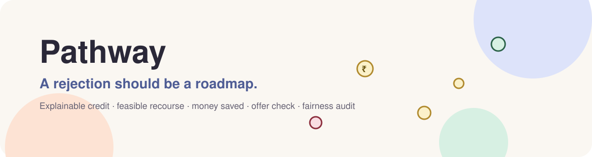
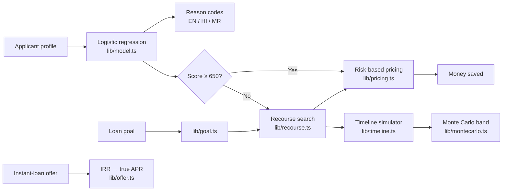

<div align="center">



<h3>Explainable credit decisions, a realistic path to approval, and the money it saves you.</h3>

<a href="https://pathway-credit-recourse.vercel.app"></a>


<br/>


</div>

---

## Why Pathway?

When a loan is declined, most people get a one-line "no" and a list of codes. They don't know **why**, **what to change**, or **when** to try again. Many then turn to instant-loan apps with hidden fees and triple-digit APRs.

**Pathway turns a rejection into a roadmap.** It explains the decision in plain English, Hindi or Marathi. It finds the smallest realistic set of changes that flips the decision, projects month by month when you'll get there, and shows what that's worth in rupees and dollars.

> **Disclaimer:** Pathway is an educational simulation built on synthetic data. It is not a credit decision, not financial advice, and not affiliated with any lender.

## Features

<table>
<tr>
<td width="50%" valign="top">&nbsp;<b>Why: reason codes</b><br/>&nbsp;Exact per-feature score impact from an interpretable model, ranked and written in plain language.</td>
<td width="50%" valign="top">&nbsp;<b>What: lowest-effort plan</b><br/>&nbsp;An exhaustive search over realistic changes. Age, dependents and other traits you can't change are never touched.</td>
</tr>
<tr>
<td valign="top">&nbsp;<b>Money saved</b><br/>&nbsp;The same loan borrowed today versus after the plan: APR tier, EMI, total interest and the next-tier bonus.</td>
<td valign="top">&nbsp;<b>When, and how sure</b><br/>&nbsp;A Monte Carlo timeline: 400 seeded futures with shocks and slips give a likely, best and worst approval month.</td>
</tr>
<tr>
<td valign="top">&nbsp;<b>Goal planner</b><br/>&nbsp;Start from the loan you want ("₹/$X at ≤ A% APR") and work backwards to the score, plan, milestones and affordability.</td>
<td valign="top">&nbsp;<b>Offer check</b><br/>&nbsp;The true APR of any instant-loan offer from its real cash flows, with red flags and guidance relevant in India.</td>
</tr>
<tr>
<td valign="top">&nbsp;<b>Fairness audit + lender report</b><br/>&nbsp;Risk-adjusted recourse-effort gaps by age and income, plus a printable adverse-action style report.</td>
<td valign="top">&nbsp;<b>Built for Bharat</b><br/>&nbsp;English, Hindi and Marathi throughout, phone-first, accessible, with a light pastel UI.</td>
</tr>
</table>

## How it works



| Step | What happens |
|---|---|
| **Train (offline)** | `ml/train.py` fits logistic regression (AUC 0.856 on hold-out) and exports coefficients to `lib/model.json`. No Python runs in production. |
| **Explain** | Every reason is an exact log-odds contribution, converted to score points. |
| **Plan** | Every feasible change set is scored exactly; the lowest weighted effort wins, ties broken by time. |
| **Project** | Each change moves at a capped monthly pace; late payments age out of a 24-month window. |
| **Stress-test** | 400 seeded simulated futures vary the pace and add income shocks and new late payments. |
| **Price** | Illustrative APR tiers by score turn the plan into interest saved. |

Every assumption lives in `lib/config.ts` and `lib/pricing.ts`, and the UI shows them next to the numbers they affect.

## Tech stack

| Layer | Tools |
|---|---|
| Framework | Next.js 16 (App Router, Turbopack), React 19, TypeScript |
| UI | Tailwind CSS 4 design tokens, shadcn/ui (Radix), Lucide icons, Recharts |
| Motion | Motion (page transitions, scroll reveals, count-ups, money cursor), reduced-motion aware |
| Model | Python + scikit-learn (training) → JSON coefficients → TypeScript inference |
| Quality | Vitest (unit and property tests), ESLint |
| Platform | Vercel, security headers + CSP, rate-limited API |

## Folder structure

```
.
├── app/                    # Routes (App Router)
│   ├── page.tsx            # Workbench: score, reasons, plan, money saved, timeline
│   ├── goal/               # Goal planner
│   ├── offer-check/        # Instant-loan offer checker
│   ├── fairness/           # Fairness audit
│   ├── report/             # Printable lender report
│   ├── method/             # How it works
│   ├── terms/ privacy/ licenses/
│   ├── api/explain/        # Optional plain-language rewrite (validated, rate-limited)
│   └── sitemap.ts robots.ts manifest.ts opengraph-image.tsx
├── components/
│   ├── workbench/ goal/ offer/ pages/ legal/   # Feature UI
│   ├── site/               # Header, footer, cookie consent, money cursor
│   ├── motion/             # Reveal, Stagger, CountUp
│   └── ui/                 # shadcn/ui primitives
├── lib/                    # Pure, tested logic
│   ├── model.ts recourse.ts timeline.ts montecarlo.ts
│   ├── pricing.ts goal.ts offer.ts evaluate.ts
│   ├── i18n.ts strings/    # EN / HI / MR
│   ├── security/           # Validation, same-origin, rate limiting
│   └── __tests__/
├── ml/train.py             # Offline training → lib/model.json
└── scripts/evaluate.ts     # Plan success, months, fairness gap → public/metrics.json
```

## Getting started

```bash
npm install
npm run dev        # http://localhost:3000
npm test           # unit tests
npm run build      # production build
```

---

## Supabase & Google Authentication Setup

Pathway integrates Supabase PostgreSQL and Google OAuth for persistent user assessments, recourse plans, simulations, pricing calculations, and ground-truth verified outcomes.

### Step 1: Create a Supabase Project
1. Go to [database.new](https://database.new) and create a new project.
2. Note your **Project URL**, **Anon (Public) Key**, and **Service Role (Secret) Key** from **Project Settings → API**.

### Step 2: Configure Google Cloud OAuth Credentials
1. Go to [Google Cloud Console](https://console.cloud.google.com/apis/credentials).
2. Create an **OAuth 2.0 Client ID** (Web application).
3. Set **Authorized JavaScript origins** to `http://localhost:3000` (and your production domain).
4. Set **Authorized redirect URIs** to your Supabase Auth callback:
   `https://<your-project-id>.supabase.co/auth/v1/callback`
5. Copy your **Client ID** and **Client Secret**.

### Step 3: Enable Google Provider in Supabase
1. In the Supabase Dashboard, go to **Authentication → Providers → Google**.
2. Toggle Google **Enabled**.
3. Paste your Google **Client ID** and **Client Secret**, then click **Save**.
4. In **Authentication → URL Configuration**, add `http://localhost:3000/auth/callback` to **Redirect URLs**.

### Step 4: Run Database Migrations
Run the reproducible SQL migration in `supabase/migrations/20261005000000_init.sql` (or paste `supabase/schema.sql` into the Supabase SQL Editor):
- Creates `profiles`, `assessments`, `recourse_plans`, `simulations`, `pricing_results`, `outcomes` tables.
- Establishes performance indexes.
- Enforces strict Row-Level Security (RLS) policies.
- Adds the `on_auth_user_created` trigger for automatic profile synchronization.

### Step 5: Configure Environment Variables
Create `.env.local` based on `.env.example`:

```env
NEXT_PUBLIC_SITE_URL=http://localhost:3000

# Supabase PostgreSQL & Auth
NEXT_PUBLIC_SUPABASE_URL=https://your-project.supabase.co
NEXT_PUBLIC_SUPABASE_ANON_KEY=your-anon-key
SUPABASE_SERVICE_ROLE_KEY=your-service-role-key

# Optional: Anthropic API for AI explanation rewrites
ANTHROPIC_API_KEY=
ANTHROPIC_MODEL=claude-haiku-4-5
```

### Step 6: Start the Application
```bash
npm run dev
```

### Step 7: Test Google Login
1. Open `http://localhost:3000`.
2. Click **"Continue with Google"** in the top navigation or on the `/login` page.
3. Authenticate with your Google account. You will be redirected to `/dashboard` with your active session.

### Step 8: Create an Assessment
1. Go to the home workbench (`/`).
2. Adjust financial features or select a sample applicant.
3. Click **"Save to Dashboard"**.

### Step 9: Verify Assessment in Supabase
1. Open the Supabase Table Editor.
2. In `assessments`, confirm that the input features, server-calculated `predicted_score`, `pd`, `reasons`, and `model_version` ("v1") are stored.

### Step 10: Verify Recourse Plan & Simulations
1. In `recourse_plans`, confirm that the computed action list and projected score are saved.
2. In `simulations` and `pricing_results`, confirm the Monte Carlo bounds and interest savings records are created.

### Step 11: Continuous Learning & Verified Outcomes
1. Navigate to `/dashboard`.
2. Submit a real-world outcome in the **"Track Real Outcome"** panel.
3. Verify that the outcome is saved with `verified = false` (preventing unverified training contamination).

### Step 12: Multi-Account RLS Isolation Test
1. Log out and sign in with a second Google account.
2. Confirm that the dashboard shows only the second user's assessments (cross-user data access is strictly blocked by RLS).

---

## Security & Privacy Architecture

- **Server-Side ML Inference:** Credit score prediction, adverse action reasoning, recourse planning, Monte Carlo timeline simulations, and risk-based pricing are computed server-side in TypeScript. Client scores are never trusted.
- **Row-Level Security (RLS):** Every user-owned table enforces `auth.uid() = user_id` at the database level.
- **Strict Zod Validation:** All API route handlers strictly validate numeric ranges, display names, and UUIDs.
- **Privacy & GDPR Compliance:** Users can permanently purge all stored account data and assessments at any time with the one-click deletion feature (`DELETE /api/user/delete`).
- **Offline ML Retraining Pipeline:** Python training remains strictly offline (`ml/train.py`). Only verified outcomes (`verified = true`) are eligible for future model evaluation and candidate model retraining.

## License

[MIT](LICENSE) © 2026 Pathway contributors. Third-party notices are on the [/licenses](https://pathway-credit-recourse.vercel.app/licenses) page.
