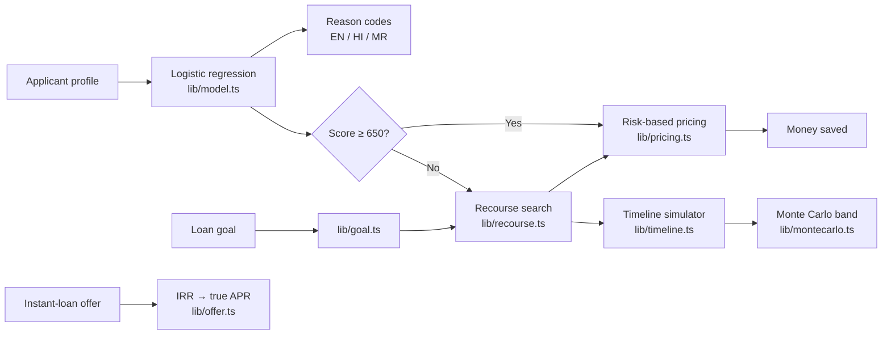

<div align="center">


<h3>Find out why a loan was declined, what to change, and when to apply again.</h3>

<a href="https://pathway-credit-recourse.vercel.app"></a>


<br/>


</div>

---

## Why Pathway?

When a loan is declined, most people get a one-line "no" and a list of codes. They don't know **why**, **what to change**, or **when** to try again. Many then turn to instant-loan apps with hidden fees and triple-digit APRs.

Pathway explains the decision in plain English, Hindi or Marathi. It finds the smallest realistic set of changes that flips the decision, projects month by month when you'll get there, and shows what that's worth in rupees. With an optional Google sign-in, borrowers can save a plan and record their numbers each month.

> **Disclaimer:** Pathway is an educational simulation built on synthetic data. It is not a credit decision, not financial advice, and not affiliated with any lender.

## Features

<table>
<tr>
<td width="50%" valign="top">&nbsp;<b>Why: reason codes</b><br/>&nbsp;Exact per-feature score impact from an interpretable model, ranked and written in plain language (credit utilisation, FOIR, DPD).</td>
<td width="50%" valign="top">&nbsp;<b>What: lowest-effort plan</b><br/>&nbsp;An exhaustive search over realistic changes. Age, dependents and other traits you can't change are never touched.</td>
</tr>
<tr>
<td valign="top">&nbsp;<b>Money saved</b><br/>&nbsp;The same personal loan taken today versus after the plan: interest rate, EMI, total interest in rupees and the next-tier bonus.</td>
<td valign="top">&nbsp;<b>When, and how sure</b><br/>&nbsp;A Monte Carlo timeline: 400 seeded futures with shocks and slips give a likely, best and worst approval month.</td>
</tr>
<tr>
<td valign="top">&nbsp;<b>Goal planner</b><br/>&nbsp;Start from the loan you want ("₹5 lakh over 3 years at 12% a year") and work backwards to the score, plan, milestones and FOIR affordability.</td>
<td valign="top">&nbsp;<b>Offer check</b><br/>&nbsp;The true APR of any instant-loan offer from its real cash flows, with red flags and guidance relevant in India.</td>
</tr>
<tr>
<td valign="top">&nbsp;<b>Fairness audit + lender report</b><br/>&nbsp;Risk-adjusted recourse-effort gaps by age and income, plus a printable adverse-action style report.</td>
<td valign="top">&nbsp;<b>Built for Bharat</b><br/>&nbsp;English, Hindi and Marathi throughout, phone-first, accessible, with a light pastel UI.</td>
</tr>
</table>

## How it works



| Step | What happens |
|---|---|
| **Train (offline)** | `ml/train.py` fits logistic regression (AUC 0.856 on hold-out) and exports coefficients to `lib/model.json`. No Python runs in production. |
| **Explain** | Every reason is an exact log-odds contribution, converted to score points. |
| **Plan** | Every feasible change set is scored exactly; the lowest weighted effort wins, ties broken by time. |
| **Project** | Each change moves at a capped monthly pace; late payments age out of a 24-month window. |
| **Stress-test** | 400 seeded simulated futures vary the pace and add income shocks and new late payments. |
| **Price** | Illustrative interest-rate tiers by score turn the plan into rupees of interest saved. |

Every assumption lives in `lib/config.ts` and `lib/pricing.ts`, and the UI shows them next to the numbers they affect.

## Tech stack

| Layer | Tools |
|---|---|
| Framework | Next.js 16 (App Router, Turbopack), React 19, TypeScript |
| UI | Tailwind CSS 4 design tokens, shadcn/ui (Radix), Lucide icons, Recharts |
| Motion | Motion (page transitions, scroll reveals, count-ups, money cursor), reduced-motion aware |
| Model | Python + scikit-learn (training) → JSON coefficients → TypeScript inference |
| Quality | Vitest (unit and property tests), ESLint |
| Platform | Vercel, security headers + CSP, rate-limited API |

## Folder structure

```
.
├── app/                    # Routes (App Router)
│   ├── page.tsx            # Home: worked example, tools, business model
│   ├── check/              # Workbench: score, reasons, plan, money saved, timeline
│   ├── partners/           # For lenders: business model and enquiry form
│   ├── signin/ account/    # Google sign-in and My plans (saved plans, progress, export, delete)
│   ├── auth/               # OAuth start, callback and sign-out route handlers
│   ├── goal/               # Goal planner
│   ├── offer-check/        # Instant-loan offer checker
│   ├── fairness/           # Fairness audit
│   ├── report/             # Printable lender report
│   ├── method/             # How it works
│   ├── terms/ privacy/ licenses/
│   ├── api/                # explain (AI rewrite), session, plans, account export
│   └── sitemap.ts robots.ts manifest.ts opengraph-image.tsx
├── components/
│   ├── workbench/ goal/ offer/ pages/ legal/   # Feature UI
│   ├── home/ partners/     # Home sections, business model (liquid glass cards), enquiry form
│   ├── site/               # Header, footer, cookie notice, language switcher
│   ├── motion/             # Reveal, Stagger, CountUp
│   └── ui/                 # shadcn/ui primitives
├── lib/                    # Pure, tested logic
│   ├── model.ts recourse.ts timeline.ts montecarlo.ts
│   ├── pricing.ts goal.ts offer.ts evaluate.ts
│   ├── i18n.ts strings/    # EN / HI / MR
│   ├── security/           # Validation, same-origin, rate limiting
│   └── __tests__/
├── ml/train.py             # Offline training → lib/model.json
└── scripts/evaluate.ts     # Plan success, months, fairness gap → public/metrics.json
```

## Getting started

```bash
npm install
npm run dev        # http://localhost:3000
npm test           # unit tests
npm run build      # production build
```

Optional: copy `.env.example` to `.env.local`.

- `NEXT_PUBLIC_SUPABASE_URL` and `NEXT_PUBLIC_SUPABASE_PUBLISHABLE_KEY` switch on accounts, saved plans and the partner enquiry form. Setup steps: [supabase/README.md](supabase/README.md).
- `ANTHROPIC_API_KEY` enables the "rewrite in simpler words" button. Without a key, the built-in templates are used.

**Money is in rupees.** The model was trained on synthetic data with the columns of a public US dataset, so rupee incomes are divided by 20 (close to India's purchasing-power parity) on the way into the model (`lib/money.ts`). Because income enters the model as a logarithm, this only shifts the scale.

**Retrain the model:** `pip install numpy pandas scikit-learn`, optionally place Kaggle's `cs-training.csv` in `data/`, then `npm run train`.

## Results

| Metric | Value |
|---|---|
| Model AUC (hold-out) | **0.856** |
| Recommended plans that flip the decision | **100%** (608 / 608 rejected hold-out applicants) |
| Median months to approval | **12** |
| Recourse-effort gap at equal risk | **31%** (income under ₹60,000 vs ₹1.2 lakh+ a month) |

## Security and privacy

- A strict security-header set: CSP, HSTS, `X-Frame-Options: DENY`, a restrictive Permissions-Policy, COOP/CORP.
- The API recomputes every explanation on the server from validated numbers. It is same-origin, JSON-only, size-capped and rate-limited.
- No tracking cookies. Accounts are optional (Google sign-in through Supabase); session cookies are HttpOnly.
- Row level security on every table; the app never uses a Supabase service key. Users can export or delete all their data from My plans.
- Sign-in return addresses are allow-listed, and `next` redirects only ever stay on this site.

## Future scope

- Reminders to log your numbers each month (WhatsApp or SMS)
- Account Aggregator cash-flow underwriting for thin-file and gig workers
- Lender dashboard: a second-chance pipeline and rejection letters that meet RBI's Fair Practices Code
- A public API for fintechs and lending apps
- Voice-first guidance in more Indian languages
- Calibration on real bureau data with a partner lender

## License

[MIT](LICENSE) © 2026 Pathway contributors. Third-party notices are on the [/licenses](https://pathway-credit-recourse.vercel.app/licenses) page.
